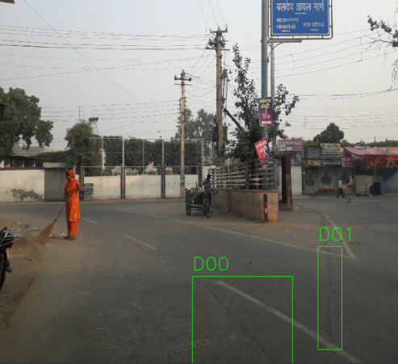
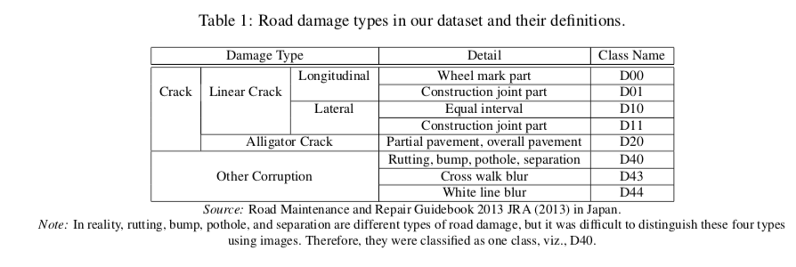

# Public Road Defects

This repository is based around a collated set of publicly available images of road surfaces annotated with rectangles around each defect, e.g.:



The defect codes are based on research by [Maeda et al.](https://arxiv.org/abs/1801.09454) (many thanks), and are categorized as follows:



The purpose of this repository is to make running experiments on these images easier by storing them in a consistent format. We've also provided some starter code for processing the raw images and then converting them into [TFRecord](https://www.tensorflow.org/tutorials/load_data/tfrecord) files, which can in turn be used for training Tensorflow models efficiently.


## Data Setup

To use the dataset in conjunction with this repository, simply clone the repo to your local machine, download the train.zip file (the link to this file will be made publicly available once we have obtained permission from the authors), and extract to `pubroaddefects/data/`. The directory structure for each dataset looks like:

```
- Name: E.g. India
  - images: contains all the raw .jpg images
  - annotations 
    - xmls: contains one XML annotation file for each image, the format is pretty self explanatory
```

So at the end you should have a directory structure that looks like

```
- app: python code to help create TFRecord files
- assets: explanatory images
- data
  - processed: where the TFRecord files end up
  - train: where the training data is stored
    - Czech
      - annotations
        - xmls
      - images
    - ...
- subsets: useful subsets of the whole dataset
- to_process: configuration files which parameterize how the raw data is converted to TFRecords
- ...
```

## Converting to TFRecord Datasets

The python code in this repository takes the raw images and annotations, formats them in some uniform way, e.g. cropping each image to a certain size or filtering out certain images, and finally converts them into TFRecord format. In this way you can easily create datasets with different attributes for experimentation purposes. Naturally, you can also ignore all of this and process the data however you like, in which case you should probably skip the rest of this section.

### Parameters

Each dataset is defined by a set of parameters. A simple example is sitting in `to_process/next.json`:

```
{
    "name": "256-public_defects_big5_subset",
    "subset": "big_5",
    "target_list": "big_5",
    "pipeline": "256x256",
    "dimensions": [
        256,
        256,
        3
    ],
    "records_per_file": 170
}
```

These parameters tell the code to create a dataset called `256-public_defects_big5_subset` with the following attributes:

**"subset": "big_5"**: this dataset will only consist of the images listed in in the "big 5" subset (i.e. `subset/big_5.json`), which only includes those images which contain at least one defect from the "big 5" defects (see `app/glob.py`). 

**"target_list": "big_5"**: it will only include defects from the big 5 defects in the dataset labels (e.g. even if one of the images contains a `Sealed_Crack` defect, this will not appear in the dataset labels). 

**"pipeline": "256x256"**: each image will be processed by the `256x256` pipeline (see `app/pipelines.py`), which just resizes each image to 256x256x3. 

**"dimensions": [256, 256, 3]**: each image in the dataset will have the dimensions 256x256x3. This parameter must be set manually, it's helpful when loading `.record` files later. 

**"records_per_file": 170**: according to the Tensorflow specs, `.record` files should ideally be between 100-200mb in size for maximum efficiency. At 256x256x3 you can reliably fit 170 samples into a single `.record` file without that file being too large or too small.

### Creating Datasets

Firstly you'll want to set up the correct python environment to run this code. I recommend using virtualenv:

```
virtualenv -p /usr/bin/python3.6 env # assuming you have python 3.6 installed, if not, you'll want to install this first and store it at /usr/bin/python3.6
# this will create a pubroaddefects/env file
source env/bin/activate
pip install -r requirements.txt
```

Now to create the dataset above simply run the command

`python make_dataset.py --workers=5 # or how ever many workers you like, more=quicker`

`make_dataset.py` will read `to_process/next.json` and create a dataset matching every set of parameters queued up in that file, saving each in `data/processed` by default. Every set of parameters processed in this way will also be saved to `to_process/saved.json` so you can keep track of which datasets you have created in the past and replicate them deterministically in the future by adding them back into the queue. These datasets can get pretty big so I find myself deleting and re-creating them fairly often.

### Notes

The current code is ONLY suitable for image classification tasks (1 label per image) and not object detection tasks (drawing bounding boxes). The locations of the bounding boxes are simply discarded. This is because we believe that ultimately there isn't that much value in object detection over image classification when it comes to getting practical value out of road fault detection AI. If you have other ideas, you can add this information to the TFRecords by making some changes to `app/tfrecords.py`.

To get the most out of this repository you will probably have to define your own custom pipelines (see `app/pipeline.py`) to do things like normalize images or apply random crops, brightness adjustments, etc. There's a little more information and some example code which loads a processed dataset in `example_training.ipynb`.

In general we found that for data augmentation the best strategy was to apply TFDataset augmentation processes on the completed dataset during training, rather than creating pipelines in `app/pipeline.py` that create datasets with multiple augmented TFRecords for each raw image.

## Recent Papers

A list of papers on the topic of road damage detection that we found to be the most helpful as starting points for assessing the state of road defect detection research: 

- [Road Damage Detection Using Deep Neural Networks with Images Captured Through a Smartphone](https://arxiv.org/abs/1801.09454): the seminal paper (in our humble opinion), achieves strong results using cellphone quality footage of road surfaces.
- [Road Damage Detection Acquisition System based on Deep Neural Networks for Physical Asset Management](https://arxiv.org/abs/1909.08991): achieves (arguably) better results by adding more data and reducing class imbalance.
- [Transfer Learning-based Road Damage Detection for Multiple Countries](https://arxiv.org/abs/2008.13101): begins to study the performance of classifiers trained on data from one country on data collected in another country.
- Also watch out for any papers resulting from the [2020 Road Damage Detection Competition](https://rdd2020.sekilab.global/overview/), they're bound to be good.
## Data Sources

All data training is sourced from publicly available datasets. All credit goes to the talented researchers responsible.

### Czech, India, Japan

**Source**: [2020 Road Damage Detection Competition](https://rdd2020.sekilab.global/data/), many thanks to the organizers. 
**Modifications**: none.  

**Bibtex Citation**

```
@misc{arya2020transfer,
    title={Transfer Learning-based Road Damage Detection for Multiple Countries},
    author={Deeksha Arya and Hiroya Maeda and Sanjay Kumar Ghosh and Durga Toshniwal and Alexander Mraz and Takehiro Kashiyama and Yoshihide Sekimoto},
    year={2020},
    eprint={2008.13101},
    archivePrefix={arXiv},
    primaryClass={cs.CV}
}
```

### ItalyMexico

**Source**: [IEEE Road Surface Damages](https://ieee-dataport.org/documents/road-surface-damages), many thanks to the researchers  who compiled the dataset. 
**Article**: [Road Damage Detection Acquisition System based on Deep Neural Networks for Physical Asset Management](https://arxiv.org/abs/1910.11123)
**Modifications**: Some annotation names were altered to bring dataset in line with the format set down by the 2020 Road Damage Detection Competition.  

**Bibtex Citation**

```
@article{DBLP:journals/corr/abs-1909-08991,
  author    = {Andres A. Angulo and
               Juan Antonio Vega Fern{\'{a}}ndez and
               Lina Maria Aguilar{-}Lobo and
               Shailendra Natraj and
               Gilberto Ochoa{-}Ruiz},
  title     = {Road Damage Detection Acquisition System based on Deep Neural Networks
               for Physical Asset Management},
  journal   = {CoRR},
  volume    = {abs/1909.08991},
  year      = {2019},
  url       = {http://arxiv.org/abs/1909.08991},
  archivePrefix = {arXiv},
  eprint    = {1909.08991},
  timestamp = {Mon, 28 Oct 2019 16:53:13 +0100},
  biburl    = {https://dblp.org/rec/journals/corr/abs-1909-08991.bib},
  bibsource = {dblp computer science bibliography, https://dblp.org}
}
```


### USA

**Source**: [Github Repository](https://github.com/fyangneil/pavement-crack-detection), many thanks to the researchers who compiled the dataset. 
**Article**: [Pavement Image Datasets: A New Benchmark Dataset to Classify and Densify Pavement Distresses](https://arxiv.org/abs/1910.11123)
**Modifications**: The files were restructured and some annotation names were altered to bring dataset in line with the format set down by the 2020 Road Damage Detection Competition.  

**Bibtex Citation**

```
@article{DBLP:journals/corr/abs-1910-11123,
  author    = {Hamed Majidifard and
               Peng Jin and
               Yaw Adu{-}Gyamfi and
               William G. Buttlar},
  title     = {{PID:} {A} New Benchmark Dataset to Classify and Densify Pavement
               Distresses},
  journal   = {CoRR},
  volume    = {abs/1910.11123},
  year      = {2019},
  url       = {http://arxiv.org/abs/1910.11123},
  archivePrefix = {arXiv},
  eprint    = {1910.11123},
  timestamp = {Fri, 25 Oct 2019 14:59:26 +0200},
  biburl    = {https://dblp.org/rec/journals/corr/abs-1910-11123.bib},
  bibsource = {dblp computer science bibliography, https://dblp.org}
}
```

### Indonesia

**Source**: [Kaggle Dataset](https://www.kaggle.com/alvarobasily/road-damage), many thanks to the author. 
**Author**: [Alvaro Basily](https://www.kaggle.com/alvarobasily).
**Modifications**: The original `.txt` annotations have been converted into the standard XML format. 


If you use this data in your own research or projects, please credit the researchers responsible for creating the original datasets.